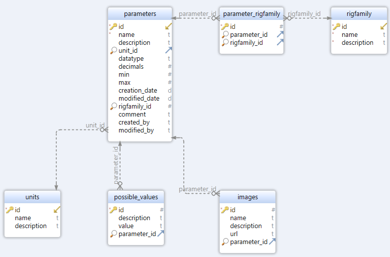

# Parameter Database

Thesis work for Volvo Trucks

## Getting started

To run the parameter database locally, you will need to follow these steps:

Clone the repository from GitHub:

```
git clone https://github.com/HampusAndersson01/Parameter-Database && cd Parameter-Database
```

Install dependencies for the API:

```
cd api && npm install
```

Create a .env file in the api root folder and add the following:

```
HOST={ip address/localhost}
USER={database username}
PASSWORD={database password}
DATABASE={database name}
```

Start the API:

```
npm run dev
```

Install dependencies for the web:

```
cd web && npm install
```

Start the web:

```
npm start
```

The API will be running on port 3000 and the web on port 3001.


### Database setup

MySQL server running on port 3306

With a database using the following schema:



#### SQL

```

CREATE SCHEMA `parameter db`;

CREATE TABLE `parameter db`.rigfamily (
id INT NOT NULL AUTO_INCREMENT PRIMARY KEY,
name VARCHAR(255) NOT NULL ,
description VARCHAR(255) NOT NULL
) ENGINE=InnoDB AUTO_INCREMENT=17 DEFAULT CHARSET=utf8mb4 COLLATE=utf8mb4_0900_ai_ci;

CREATE TABLE `parameter db`.units (
id INT NOT NULL AUTO_INCREMENT PRIMARY KEY,
name VARCHAR(255) ,
description TEXT
) ENGINE=InnoDB AUTO_INCREMENT=107 DEFAULT CHARSET=utf8mb4 COLLATE=utf8mb4_0900_ai_ci;

CREATE TABLE `parameter db`.parameters (
id INT NOT NULL AUTO_INCREMENT PRIMARY KEY,
name VARCHAR(255) NOT NULL ,
description TEXT ,
unit_id INT ,
datatype VARCHAR(20) ,
decimals DOUBLE ,
min DOUBLE ,
max DOUBLE ,
creation_date DATE ,
modified_date DATE ,
rigfamily_id INT ,
comment TEXT ,
created_by VARCHAR(40) ,
modified_by VARCHAR(40)
) ENGINE=InnoDB AUTO_INCREMENT=6848 DEFAULT CHARSET=utf8mb4 COLLATE=utf8mb4_0900_ai_ci;

CREATE INDEX parameters_ibfk_1 ON `parameter db`.parameters ( unit_id );

CREATE INDEX parameters_ibfk_2 ON `parameter db`.parameters ( rigfamily_id );

CREATE TABLE `parameter db`.possible_values (
id INT NOT NULL AUTO_INCREMENT PRIMARY KEY,
description TEXT ,
value TEXT ,
parameter_id INT
) ENGINE=InnoDB DEFAULT CHARSET=utf8mb4 COLLATE=utf8mb4_0900_ai_ci;

CREATE INDEX fk_possible_values_parameters ON `parameter db`.possible_values ( parameter_id );

CREATE TABLE `parameter db`.images (
id INT NOT NULL AUTO_INCREMENT PRIMARY KEY,
name VARCHAR(100) ,
description TEXT ,
url TEXT ,
parameter_id INT
) ENGINE=InnoDB AUTO_INCREMENT=21 DEFAULT CHARSET=utf8mb4 COLLATE=utf8mb4_0900_ai_ci;

CREATE INDEX fk_images_parameters ON `parameter db`.images ( parameter_id );

CREATE TABLE `parameter db`.parameter_rigfamily (
id INT NOT NULL AUTO_INCREMENT PRIMARY KEY,
parameter_id INT ,
rigfamily_id INT
) ENGINE=InnoDB AUTO_INCREMENT=8207 DEFAULT CHARSET=utf8mb4 COLLATE=utf8mb4_0900_ai_ci;

CREATE INDEX fk_parametere_rigfamily_parameters ON `parameter db`.parameter_rigfamily ( parameter_id );

CREATE INDEX fk_parametere_rigfamily_rigfamily ON `parameter db`.parameter_rigfamily ( rigfamily_id );

ALTER TABLE `parameter db`.images ADD CONSTRAINT fk_images_parameters FOREIGN KEY ( parameter_id ) REFERENCES `parameter db`.parameters( id ) ON DELETE NO ACTION ON UPDATE NO ACTION;

ALTER TABLE `parameter db`.parameter_rigfamily ADD CONSTRAINT fk_parametere_rigfamily_parameters FOREIGN KEY ( parameter_id ) REFERENCES `parameter db`.parameters( id ) ON DELETE NO ACTION ON UPDATE NO ACTION;

ALTER TABLE `parameter db`.parameter_rigfamily ADD CONSTRAINT fk_parametere_rigfamily_rigfamily FOREIGN KEY ( rigfamily_id ) REFERENCES `parameter db`.rigfamily( id ) ON DELETE NO ACTION ON UPDATE NO ACTION;

ALTER TABLE `parameter db`.parameters ADD CONSTRAINT parameters_ibfk_1 FOREIGN KEY ( unit_id ) REFERENCES `parameter db`.units( id ) ON DELETE NO ACTION ON UPDATE NO ACTION;

ALTER TABLE `parameter db`.possible_values ADD CONSTRAINT fk_possible_values_parameters FOREIGN KEY ( parameter_id ) REFERENCES `parameter db`.parameters( id ) ON DELETE NO ACTION ON UPDATE NO ACTION;

```

## Docs for the API and Web

[API](api/README.md)

[Web](web/README.md)
