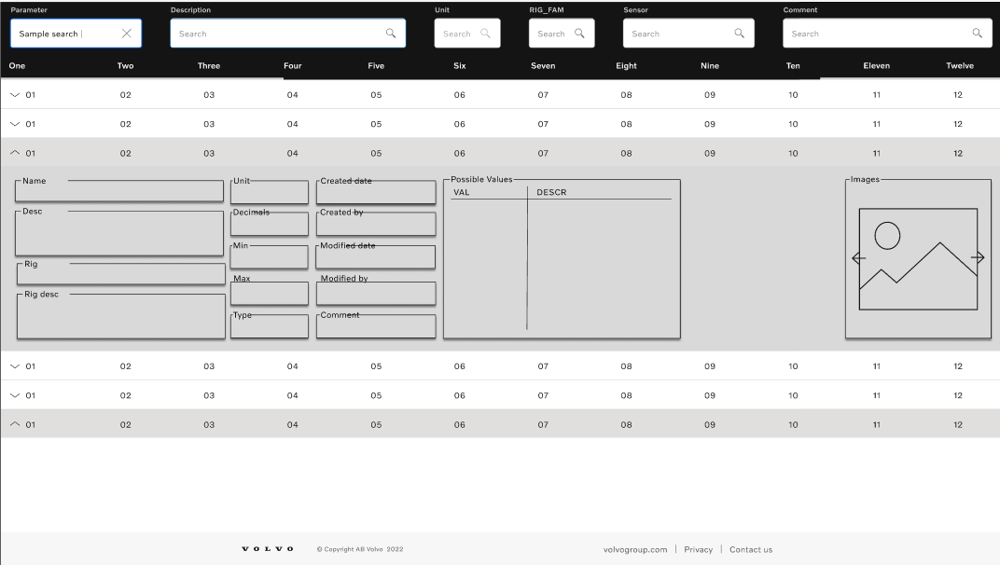
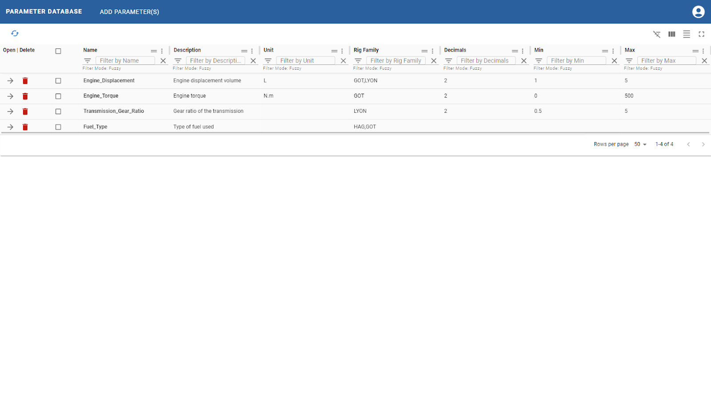
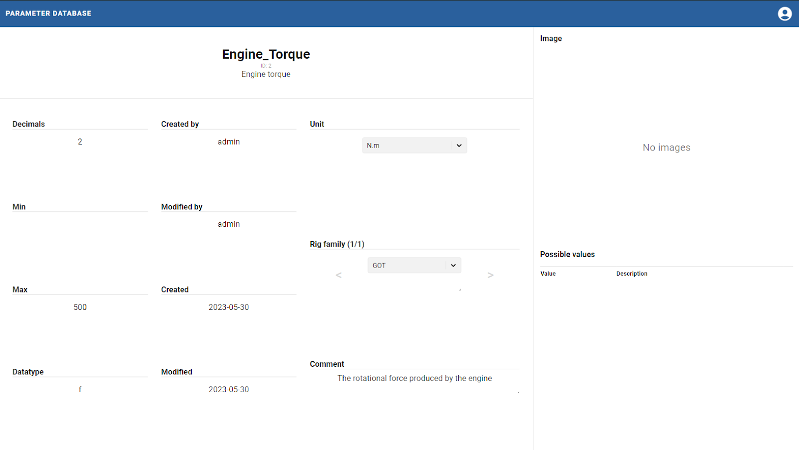
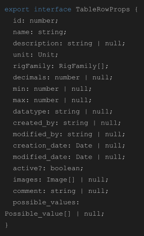
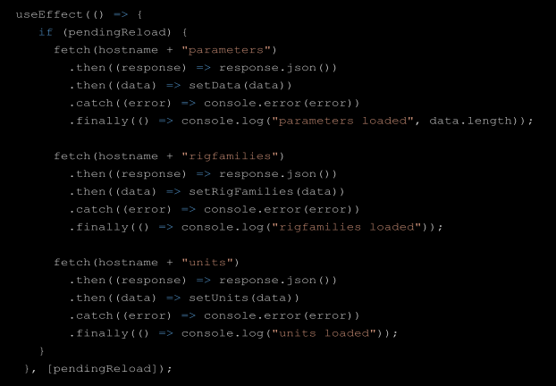
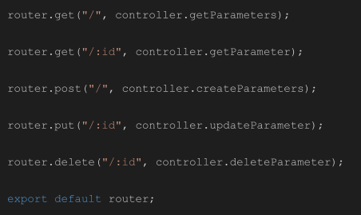

# _Thesis Work_

## Optimizing Parameter Management: A User-Friendly Solution for Volvo Trucks

### Efficient and Accessible Parameter Database with Web Interface, React, Typescript, and MySQL Integration

SUVNET21  
2023-05-08 – 2023-06-02  
Hampus Andersson

### Abstract

This report presents the development of a user-friendly parameter database with a web interface and API for Volvo Trucks. The objective of this project was to address the challenges associated with handling a large volume of parameter data and to provide a centralized platform for parameter management. The parameter database system streamlines parameter management processes, enhances operational efficiency, and improves decision-making within Volvo Trucks. The web interface, developed using React and Typescript, offers a seamless user experience, enabling users to easily search, view, and manage parameters. The API acts as a link between the web interface and the MySQL database, facilitating efficient data retrieval and updates. The development process followed a structured methodology, including requirements gathering, technology selection, web design and interface development, and code implementation. The parameter database system offers several key features, including import/export with Excel, enhanced search functionality, table customization, and URL-based search parameter sharing. User feedback and usability testing have indicated high satisfaction with the system's functionality and ease of use. Although certain planned features were not implemented within the given timeframe, the core functionality of the parameter database system remains intact. The system holds significant importance for Volvo Trucks, providing enhanced efficiency, improved decision-making, standardization, and collaboration opportunities. The successful development and implementation of the parameter database system contribute to improved operational processes, product quality, and overall decision-making within Volvo Trucks.

  
****

### Table of Contents

- [1. Introduction](#introduction)
  - [1.1. Significance and Potential Benefits](#significance-and-potential-benefits)
  - [1.2. Organizational Context](#organizational-context)
  - [1.3. Objective](#objective)
- [2. Methodology](#methodology)
  - [2.1. Requirements Gathering](#requirements-gathering)
    - [2.1.1. Initial Specifications and User Feedback](#initial-specifications-and-user-feedback)
    - [2.1.2. Database Design: Refining the Schema](#database-design-refining-the-schema)
  - [2.2. Technology Selection](#technology-selection)
  - [2.3. Working Method](#working-method)
  - [2.4. Web Design and Interface Development](#web-design-and-interface-development)
  - [2.5. Parameter Display and Customizability](#parameter-display-and-customizability)
  - [2.6. Code Implementation and Development](#code-implementation-and-development)
    - [2.6.1. Frontend Development](#frontend-development)
    - [2.6.2. Backend Development](#backend-development)
    - [2.6.3. Database Integration](#database-integration)
  - [2.7. Summary](#summary)
- [3. Results and Analysis](#results-and-analysis)
  - [3.1. Development Process Outcome](#development-process-outcome)
  - [3.2. Functionality Evaluation](#functionality-evaluation)
  - [3.3. User Feedback and Usability](#user-feedback-and-usability)
  - [3.4. System Evaluation](#system-evaluation)
- [4. Next Steps](#next-steps)
  - [4.1. Further Development and Integration](#further-development-and-integration)
    - [4.1.1. Image Upload to Web Server](#image-upload-to-web-server)
  - [4.2. Authentication and Access Control](#authentication-and-access-control)
  - [4.3. Evaluation and Continuous Improvement](#evaluation-and-continuous-improvement)
    - [4.3.1. Performance Monitoring and Optimization](#performance-monitoring-and-optimization)
    - [4.3.2. User Feedback and Feature Enhancement](#user-feedback-and-feature-enhancement)
  - [4.4. Conclusion](#conclusion)
- [5. References](#references)

<h3 id="introduction">1. Introduction</h3>

This report presents the development of a user-friendly parameter database with a web interface and API for Volvo Trucks. The project aimed to improve parameter management within Volvo Group by creating an efficient and accessible solution. The database, web interface, and API were independently developed using React, Typescript, and MySQL. Feedback and guidance from senior developers were instrumental in refining the project. Throughout the development process, industry-standard tools like GitHub were utilized for version control, ensuring smooth collaboration and efficient project management.

The objective of this project is to address the challenges associated with handling a large volume of parameter data and to provide a centralized platform for parameter management. The effective management of parameters is crucial for Volvo Trucks as it impacts various aspects of their operations, including product development, quality assurance, and after-sales support. By leveraging the capabilities of React and Typescript, the web interface offers a seamless user experience, enabling users to easily search, view, and manage parameters. The API acts as a link between the web interface and the database, facilitating efficient data retrieval and updates.

<h4 id="significance-and-potential-benefits">1.1. Significance and Potential Benefits</h4>

The development of the parameter database system holds significant importance for Volvo Trucks. By implementing this system, the company can benefit from:

1. Enhanced Efficiency: The parameter database system streamlines parameter management processes, eliminating manual and time-consuming tasks. With an intuitive web interface and efficient data retrieval, employees can quickly access and update parameter information, leading to improved operational efficiency.

2. Improved Decision-making: A comprehensive and well-organized parameter database enables better data analysis and decision-making. Users can easily search and retrieve relevant parameter information, empowering them to make informed decisions based on accurate and up-to-date data.

3. Standardization and Consistency: The parameter database system promotes standardization and consistency in managing parameters across different teams and locations within Volvo Group. This ensures that everyone is working with the same set of parameters, reducing errors and inconsistencies in product development and maintenance processes.

4. Collaboration and Knowledge Sharing: The web interface and API facilitate collaboration among team members by enabling the sharing of parameter data and insights. Users can customize the display and visibility of parameters, allowing them to tailor the system to their specific needs and share relevant information with colleagues.

By achieving these objectives and reaping these potential benefits, the project aims to contribute to improved operational processes, product quality, and overall decision-making within Volvo Trucks.

The subsequent sections will provide a detailed account of the project, highlighting key aspects, achievements, and recommendations for further development.

<h4 id="organizational-context">1.2. Organizational Context</h4>

The target audience for this project is Volvo Trucks, a prominent company in the commercial vehicle industry (Volvo Trucks, 2023). The parameter database system, web interface, and API developed in this project are intended to cater to the internal requirements of Volvo Group globally, including locations such as Lyon, France, and Hagerstown, USA (Volvo Group, 2023).

<h4 id="objective">1.3. Objective</h4>

The objective of this project was to develop a parameter database system that would streamline parameter management processes and enhance efficiency within Volvo Trucks. The focus was on creating a user-friendly web interface, complemented by an API, to facilitate seamless access and management of parameters. Additionally, the project aimed to expand the capabilities of the current database by incorporating new functionalities, including the ability to store and manage images. By achieving these objectives, the project aimed to contribute to improved operational processes and decision-making within the company.

<h3 id="methodology">2. Methodology</h3>

This section presents the methodology employed in the development of a user-friendly parameter database with a web interface and API for Volvo Trucks. The methodology outlines the key steps and choices made during the project's execution, including requirements gathering, technology selection, web design and interface development, and parameter display customization.

<h4 id="requirements-gathering">2.1. Requirements Gathering</h4>

The requirements gathering phase aimed to understand the desired functionality of the parameter database system. It involved utilizing a written specification from a few years back as a foundation. Additionally, a series of meetings with the development team, who would eventually maintain the project, were conducted to gather further insights and clarify any ambiguities in the specifications.

<h5 id="initial-specifications-and-user-feedback">2.1.1. Initial Specifications and User Feedback</h5>

During the initial meetings, future users expressed specific requirements and requested certain features to be included in the parameter database system. One such feature was the ability to import and export data to and from Excel. This functionality was deemed important for easy migration of data between different systems and to facilitate efficient data management processes. The import and export feature would enable users to seamlessly transfer parameter data in Excel format, ensuring compatibility and ease of use.

<h5 id="database-design-refining-the-schema">2.1.2. Database Design: Refining the Schema</h5>

The database design phase focused on developing a suitable schema for the parameter database system. Initially, the database schema followed the provided specification and was kept simple. However, through the collaborative discussions and feedback received during the meetings, it became evident that a more detailed schema would better serve the needs of the parameter database system.

After several iterations and discussions, a refined database schema was agreed upon, striking a balance between complexity and simplicity. The final schema captured the necessary fields and relationships to effectively store and manage parameter data within Volvo Trucks.

While the initial schema served as a starting point, the revisions made during the meetings and development process ensured that the final schema aligned more closely with the specific requirements and objectives of the project. The simplified, yet comprehensive, database schema formed the foundation for the subsequent development of the parameter database system.

<h4 id="technology-selection">2.2. Technology Selection</h4>

The selection of technologies for the project was guided by Volvo Group's IT infrastructure policy. React with Typescript was chosen as the frontend framework due to its advantages such as component reusability, performance optimization, and strong typing. The decision was also influenced by the developer's previous experience with React and Typescript.

MySQL was selected as the database management system due to its compatibility with the existing infrastructure and its proven reliability in handling large volumes of data.

<h4 id="working-method">2.3. Working Method</h4>

To effectively manage the development process, a specific working method was employed. Separate repositories on GitHub were used for the API and web UI components, which were later merged into a single combined repository. A project board was created within GitHub, where new issues for functionality and bug tracking purposes were continuously added. The development process followed a branch-per-issue approach to address specific issues individually while maintaining a structured and organized workflow.

<h4 id="web-design-and-interface-development">2.4. Web Design and Interface Development</h4>

The web design process aimed to ensure a seamless transition for users from the previous parameter database system, thereby encouraging their adoption of the new solution. Initial sketches were created to outline the layout and structure of the web interface. These sketches were then translated into a detailed Figma prototype (see Figure 1), which served as a visual representation of the proposed design.

The Figma prototype underwent evaluation and feedback from users, as well as my own evaluation. While collecting valuable insights from users, I also assessed the design and identified areas for improvement. One of the main reasons for the modifications was that I wasn't completely satisfied with how the design looked on both desktop and phone views. It was crucial to enhance the overall aesthetics and ensure a clean and intuitive look that would resonate with users. By incorporating the feedback and addressing my own concerns, the final design achieved improved accessibility, usability, and aesthetics while providing users with comprehensive parameter information.

<h4 id="parameter-display-and-customizability">2.5. Parameter Display and Customizability</h4>

The initial design in Figma featured an expandable table to display all parameter information. However, during the development process, a decision was made to provide a separate page for each parameter. This approach ensured a clear view of the parameter data, regardless of the device being used. The web interface's table was designed to be highly customizable, empowering users with the ability to hide/show columns, adjust column size and order, and sort and search by each column. This customization feature aimed to accommodate users' specific preferences and enable efficient parameter management. Furthermore, additional features, such as import and export capabilities for multiple parameters in Excel format, were implemented to simplify data migration between platforms.

<h4 id="code-implementation-and-development">2.6. Code Implementation and Development</h4>

The code implementation and development phase involved translating the design and requirements into functional code for the parameter database system. The development process followed industry best practices, including modular coding, adherence to coding standards, and frequent code reviews.

<h5 id="frontend-development">2.6.1. Frontend Development</h5>

The frontend development focused on implementing the web interface using React and Typescript. Several key components were developed to handle different functionalities within the parameter database system.

The ParameterTable component plays a crucial role in the frontend development of the user-friendly parameter database system. Within this component, the TableRowProps interface is used to define the structure of each table row, encapsulating various properties representing the details of a parameter.

To populate the parameter table with data, the component utilizes the useEffect hook, which triggers a fetch operation from the backend API when a specific condition, denoted by the pendingReload variable, changes. This condition ensures that the data is fetched only when necessary.

The code snippet demonstrates the asynchronous data fetching process. The fetch function is used to send HTTP requests to the API endpoints corresponding to the parameters, rig families, and units. The responses are then processed using the .json() method to extract the data.

Upon successful retrieval of data, the setData, setRigFamilies, and setUnits functions update the state variables data, rigFamilies, and units, respectively. These state variables, defined using the useState hook, store the fetched data for further use in the component.

In the event of an error during the API request, the code includes error handling using .catch(). Any encountered error is logged to the console for debugging purposes.

Additionally, the finally block ensures that a log message is displayed in the console, indicating the successful completion of the data loading process.

By fetching and storing the necessary data from the API, the ParameterTable component establishes the foundation for rendering the parameter table with up-to-date information. The retrieved data, rigFamilies, and units can be seamlessly integrated into the component's rendering logic to present a comprehensive and user-friendly view of the parameters within the web interface.

<h5 id="backend-development">2.6.2. Backend Development</h5>

The backend development phase of the parameter database system focused on creating a robust API using Node.js and the Express framework. This API serves as the backbone for handling parameter-related operations, enabling seamless communication between the frontend application and the backend server.

To implement the backend functionalities, the following technologies were utilized:

The provided code snippet showcases the implementation of API routes responsible for handling various HTTP methods such as GET, POST, PUT, and DELETE. These routes are designed to handle parameter-related operations, allowing clients to interact with the parameter database system effectively.

By utilizing the Express framework, the API routes are organized and structured in a modular manner. The router object is used to define the routes, and each route is associated with a specific endpoint and controller function from the parameters module.

The controller functions, located in the parameters.ts file within the controllers directory, are responsible for processing the incoming requests and generating appropriate responses. These functions interact with the underlying data model to perform operations such as retrieving all parameters, retrieving a parameter by its ID, creating new parameters, updating existing parameters, and deleting parameters.

To enhance the documentation and standardize the API description, Swagger annotations are incorporated within the route definitions. These annotations provide clear descriptions of the API endpoints, their parameters, and expected responses, making it easier for developers to understand and utilize the API effectively.

By following best practices and leveraging the power of Node.js and Express, the backend development phase establishes a solid foundation for the parameter database system. The implementation of API routes, along with their corresponding controller functions, ensures smooth communication between the frontend and backend, facilitating seamless parameter management within the application.

<h5 id="database-integration">2.6.3. Database Integration</h5>

The MySQL database was integrated with the backend to store and retrieve parameter data. SQL queries were carefully optimized to ensure efficient data retrieval and manipulation. The database schema, as discussed in section 2.1.2, was implemented using SQL scripts, ensuring the proper structure and relationships were established.

By incorporating robust coding practices, the code implementation and development phase ensured the delivery of a reliable and high-quality parameter database system.

<h4 id="summary">2.7. Summary</h4>

In this section, the methodology employed in the development of the parameter database system with a web interface and API was presented. The methodology included requirements gathering, technology selection, web design and interface development, parameter display customization, and code implementation and development. The chosen approach aimed to deliver a user-friendly parameter database system that meets the specific needs of Volvo Trucks while considering scalability and future enhancements.

<h3 id="results-and-analysis">3. Results and Analysis</h3>

<h4 id="development-process-outcome">3.1. Development Process Outcome</h4>

In this section, we present the outcome of the development process for the parameter database system, web interface, and API. The system was developed to meet the specific needs of Volvo Trucks, with a focus on enhancing parameter management processes and providing an intuitive user experience. However, due to implementation constraints within Volvo IT, some features such as image upload to the web server and authentication were not implemented within the given timeframe.

One of the significant challenges encountered during the development process was related to the performance of the web interface. The parameter database included approximately 8000 parameters, which posed performance issues when displaying the data to users. To address this challenge, different approaches were explored, including the implementation of infinite scroll using virtualization. However, after extensive experimentation and evaluation, a simpler pagination approach was adopted. This solution proved to be more effective in ensuring optimal performance across various devices and provided a seamless user experience.

Despite the limitations and challenges faced, the development process was successfully completed within the specified timeline, resulting in a functional parameter database system.

<h4 id="functionality-evaluation">3.2. Functionality Evaluation</h4>

The parameter database system developed for Volvo Trucks demonstrated a range of functionalities aimed at improving parameter management processes. The following features were successfully implemented:

a) Import/Export with Excel: The system allows users to import and export parameter data using Excel files, facilitating easy data exchange and integration with external tools.

b) Enhanced Search Functionality: Compared to the previously existing system, the new parameter database offers an improved search function that enables users to search within each column of the database. This enhancement significantly enhances the efficiency and accuracy of parameter retrieval.

c) Table Customization: To cater to the diverse needs of users, the system offers customization options for the displayed tables. Users can adjust column width, order, and visibility, ensuring a personalized and efficient user experience.

d) URL-Based Search Parameter Sharing: The system allows users to share search results with others by generating a URL containing the search parameters. This feature simplifies collaboration and enables seamless knowledge sharing among users.

Although the original plan included features such as image upload to the web server and authentication, their implementation was dependent on integration with Volvo IT, which proved to be time-consuming. Despite their absence, the core functionality of the parameter database system remains intact, and users can leverage its features to streamline their parameter management processes effectively.

<h4 id="user-feedback-and-usability">3.3. User Feedback and Usability</h4>

The parameter database system was subjected to user feedback and usability testing to evaluate its effectiveness and user satisfaction. The feedback received from Volvo Trucks personnel has been overwhelmingly positive. Users expressed their satisfaction with the overall functionality, ease of use, and the efficiency brought about by the new features.

In particular, the newly implemented features have been highly appreciated by the users. The import/export functionality with Excel received praise for its seamless data integration capabilities. The enhanced search functionality was highlighted as a significant improvement over the previous system, allowing users to quickly locate and retrieve relevant parameter data. The customization options provided users with the flexibility to tailor the system to their specific needs, further enhancing the overall user experience.

<h4 id="system-evaluation">3.4. System Evaluation</h4>

The parameter database system has proven to be an effective solution for managing parameters within Volvo Trucks. The system streamlines parameter management processes, improves search efficiency, and provides users with a customizable and user-friendly interface. Despite the absence of certain features, such as image upload and authentication, the system fulfills its intended purpose and meets the needs of users effectively.

The impact of the system on operational processes, decision-making, and user experience has been positive. It has significantly reduced the time and effort

<h3 id="next-steps">4. Next Steps</h3>

<h4 id="further-development-and-integration">4.1. Further Development and Integration</h4>

The completion of this thesis work marks an important milestone in the development of the parameter database system for Volvo Trucks. However, there are still areas where further development and integration can be pursued to enhance the system's functionality and usability.

<h5 id="image-upload-to-web-server">4.1.1. Image Upload to Web Server</h5>

The implementation of image upload functionality was postponed due to integration complexities with Volvo IT. Moving forward, it is recommended to prioritize the integration of this feature to enable users to associate images with parameter data. This enhancement will provide visual representation and aid in better understanding and managing parameters.

<h4 id="authentication-and-access-control">4.2. Authentication and Access Control</h5>

Implementing authentication and access control mechanisms is crucial to ensure that only authorized personnel can access and modify the parameter database. Integration with Volvo IT's authentication system should be explored to ensure consistency and adherence to security protocols.

<h4 id="evaluation-and-continuous-improvement">4.3. Evaluation and Continuous Improvement</h5>

Continuous evaluation and improvement are crucial for ensuring the long-term success and sustainability of the parameter database system. Ongoing monitoring of system performance, user satisfaction, and evolving user requirements will provide valuable insights for future enhancements and updates.

<h5 id="performance-monitoring-and-optimization">4.3.1. Performance Monitoring and Optimization</h4>

Regular performance monitoring should be conducted to identify any bottlenecks or areas of improvement. This can involve tracking response times, database performance, and system utilization metrics. Based on the findings, optimization measures should be implemented to maintain optimal system performance.

<h5 id="user-feedback-and-feature-enhancement">4.3.2. User Feedback and Feature Enhancement</h4>

Actively seeking and incorporating user feedback will be vital for identifying potential areas of improvement and introducing new features. Regular communication with users and user feedback surveys will facilitate the evolution of the parameter database system in line with changing requirements.

<h4 id="conclusion">4.4. Conclusion</h5>

The successful completion of this thesis work provides a solid foundation for the further development, integration, and adoption of the parameter database system within Volvo Trucks. By addressing the identified areas of improvement, such as image upload and authentication, and investing in continuous evaluation and improvement, the system can continue to evolve and deliver value to its users and the organization as a whole.

<h3 id="references">5. References</h3> 

Volvo Trucks. (2023). About us. Retrieved from https&#x3A;//www.volvotrucks.com/en-en/about-us.html

Volvo Group. (2023). Company overview. Retrieved from https&#x3A;//www.volvogroup.com/en-en/about-us/overview.html
